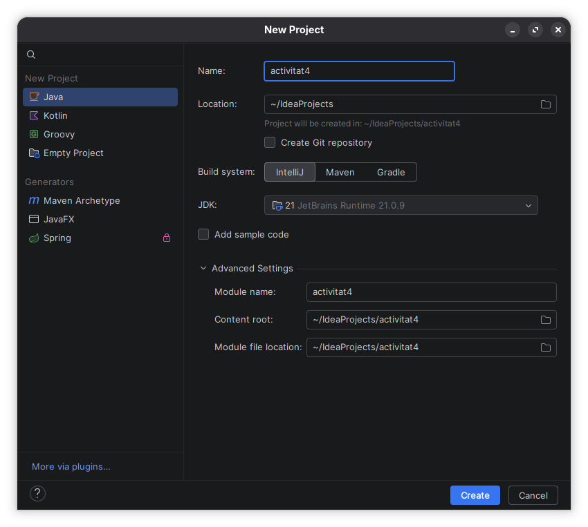
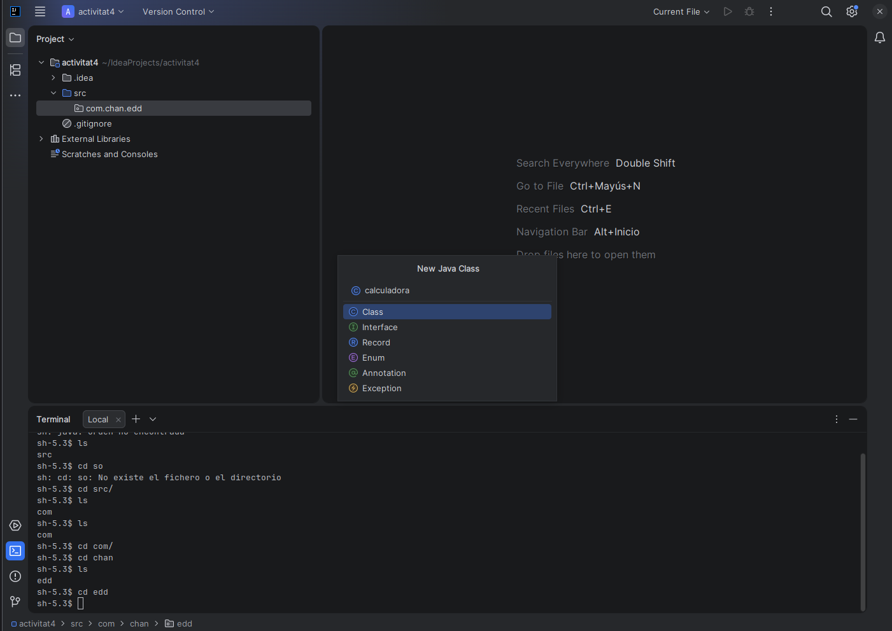
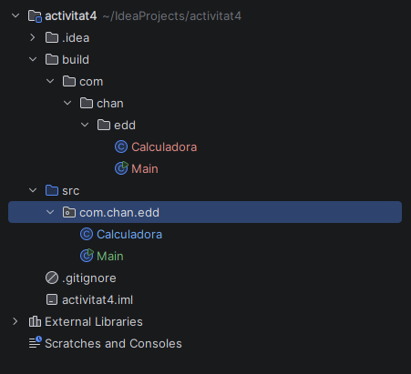
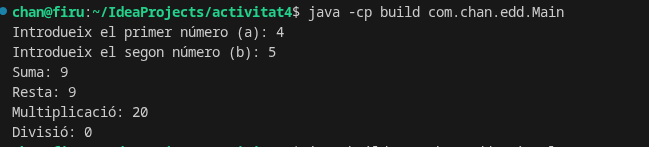

### Chan Voong Tran

## Tasca automatitzacions EDD

Per a acomplir aquesta tasca anem a utilitzar Intellij.

Creem un package i posen el nom: com.chan.edd

Una volta creada el package, creem dos classes (Calculadora i Main) amb aquest codi:

Calculadora.java

~~~
package com.chan.edd;

public class Calculadora {
    public static int suma (int a, int b) {

        return a + b;
    }
    public static int resta (int a, int b) {
        return a + b;
    }
    public static int multiplica (int a, int b) {

        return a * b;
    }
    public static int divideix (int a, int b) {
        if (b == 0) {
            System.out.println("Error, b no puede ser cero");
            return 0;
        }
        return a / b;
    }

}

~~~
Main.java

~~~ 

package com.chan.edd;
import java.util.Scanner;

public class Main {
    public static void main(String[] args) {
        // Creem un objecte Scanner
        Scanner teclat = new Scanner(System.in);

        System.out.print("Introdueix el primer número (a): ");
        int x = teclat.nextInt();

        System.out.print("Introdueix el segon número (b): ");
        int y = teclat.nextInt();

        System.out.println("Suma: " + Calculadora.suma(x, y));
        System.out.println("Resta: " + Calculadora.resta(x, y));
        System.out.println("Multiplicació: " + Calculadora.multiplica(x, y));
        System.out.println("Divisió: " + Calculadora.divideix(x, y));

    }
}
~~~
Luego en terminal vamos a la carpeta del proyecto y creamos la carpeta "build" 

~~~
mkdir build 

javac -d build -claspath build src/com/chan/edd/Main.java 

javac -d build -classpath build src/com/chan/edd/Main.java
~~~

Podemos ver en Intellij que el directorio build replica las carpetas de src.

Abrimos terminal y ejecutamos:

`java -cp build com.chan.edd.Main` 

