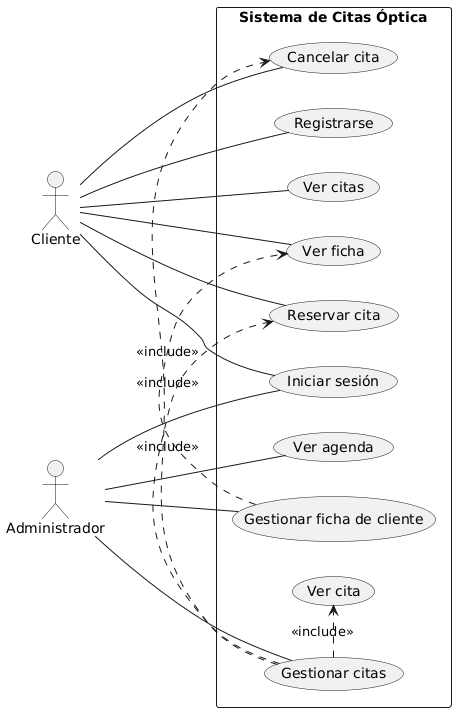
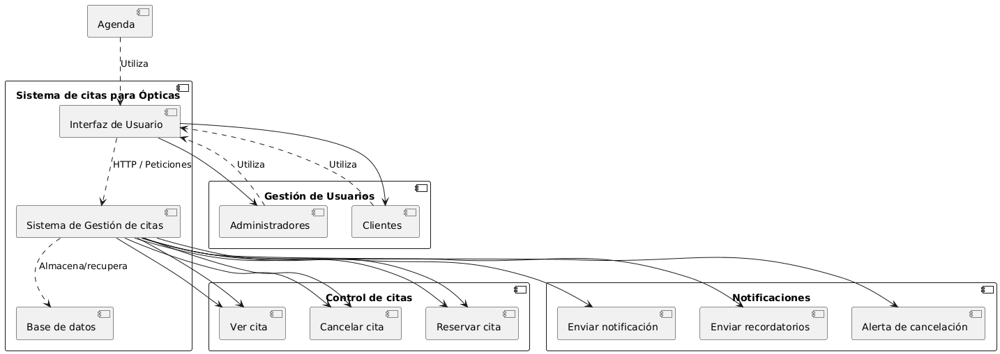
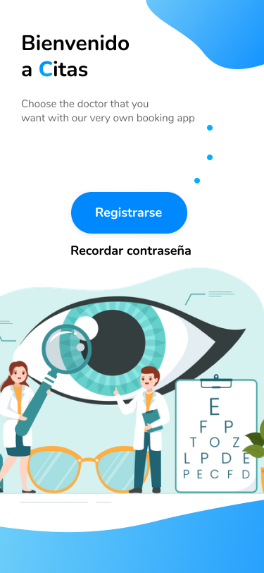
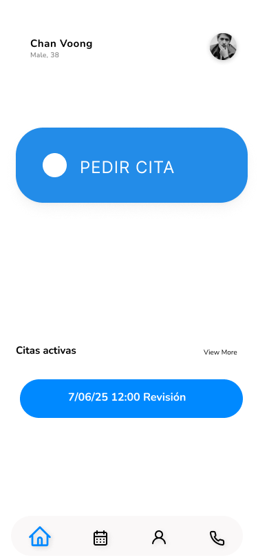
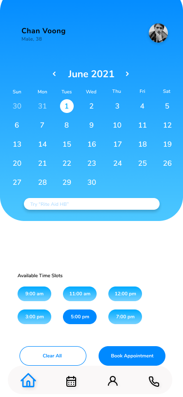
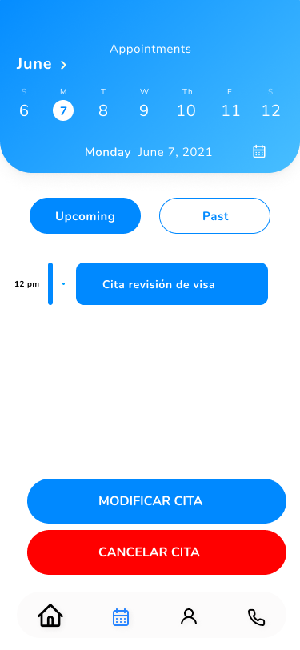
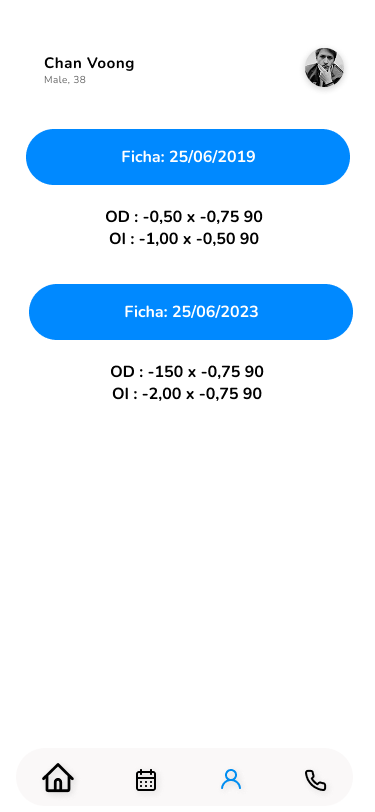
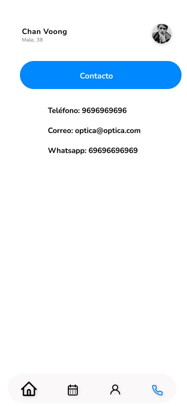

### Chan Voong Tran

#### Proyecto intermodular 

#### 2da entrega

### Objetivo 

El objetivo de esta segunda entrega es de diseñar la arquitectura técnica de una aplicación de reserva de citas.

Se ha utilizado diagramas UML y unos bocemos UI/UX

### Diagrama UML casos de uso
Tendremos dos actores principales:
* Cliente y Administrador, que será el óptico o el auxiliar.
* Los diferentes acciones que podrá hacer cada uno:	

  * Cliente:
     * Reservar cita
     * Modificacion de cita
     * Cancelar cita
     * Visualizar cita
     * Seguimiento de cita
     * Confirmación de cita
     * Visualizar ficha
     
  * Administrador:
     * Administrar cita
     * Administrar agenda
     * Administrar ficha
     * Administrar usuarios

### Diagrama UML de componentes

El diagrama de componentes muestra la estructura general del sistema y la relación entre sus principales módulos: Control de citas, fichas, agenda y notificaciones.
El sistema se divide en un frontend web, encargado de la interacción con el usuario, un backend que gestiona la lógica del sistema de reservas y una base de datos donde se almacenan las citas, los clientes y la ficha del cliente.

### UI/UX

El diseño UI/UX planteado es ser lo más simple posible, teniendo en cuenta que el objetivo principal de una óptica es gente de edad avanzada. Se ha diseñado para tener pocos clicks, botones grandes y buen legibilidad.
Tenemos la pantalla de login

La pantalla de dashboard aparece el boton para agendar una cita y las citas que tenemos pendientes

Aquí podemos ver el calendario para poder elegir fecha

Aquí podemos seleccionar una franja horaria

En esta sección podríámos ver un historial de fichas

No podría faltar un apartado para poder contactar con los datos de la óptica.

